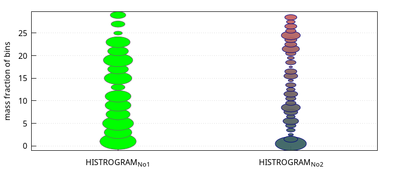

<!DOCTYPE html>
<html lang="">
  <head>
        <link rel="stylesheet" type="text/css" href="bubble_Beispiel_1_htmlimg/bubble_Beispiel_1.css"/>
  </head>
  <body>
    
\(      \DeclareMathOperator{\abs}{abs}
      \newcommand{\ensuremath}[1]{\mbox{$#1$}}
\)

    <!-- Text cell -->
    

      
Hint:
         It might be nessesary to
         load(operatingsystem)$
         chdir("/path/to/your/current/folder");

    

    <!-- Code cell -->
    <table>
      <tr>
        <td>
          (%i9)	
  
        </td>
        <td>
          
            load
            (
            "./histogram_V10.mac"
            )
            $
          
        </td>
      </tr>
    </table>
    <!-- Code cell -->
    <table>
      <tr>
        <td>
          (%i13)	
  
        </td>
        <td>
          
            STRCUT
            :
            histogram_ext
            (
            
               
                
            makelist
            (
            random
            (
            30
            )
            ,
            200
            )
            ,
            
               
                
            makelist
            (
            [
            i
            ,
            i
            +
            DELTA
            ]
            ,
            i
            ,
            0
            ,
            30
            ,
            DELTA
            )
            )                 
            ,
            DELTA
            =
            2
            $
            
               
            
            wxdraw2d
            (
            
               
                
            histogram_bubbles
            (
            STRCUT
            ,
            '
            mass
            ,             
            bubble_scale
            =
            17
            ,
            bubble_fill
            =
            green
            )
            ,
            
               
                
            histogram_bubbles
            (
            STRCUT2
            ,
            '
            mass
            ,
            bubble_x
            =
            2
            ,
            bubble_scale
            =
            17
            ,
            bubble_fill
            =
            FANCY
            ,
            bubble_line
            =
            navy
            )
            ,
            
               
                
            xtics
            =
            {
            [
            "HISTROGRAM_{No1}"
            ,
            1
            ]
            ,
            [
            "HISTROGRAM_{No2}"
            ,
            2
            ]
            }
            ,
            
               
                
            xrange
            =
            [
            0
            .
            5
            ,
            2
            .
            5
            ]
            ,
            
               
                
            grid
            =
            true
            
               
            
            )   
            
               
            
            ,   
            STRCUT2
            =
            histogram_ext
            (    
            makelist
            (
            random
            (
            30
            )
            ,
            200
            )
            ,     
            makelist
            (
            [
            i
            ,
            i
            +
            1
            ]
            ,
            i
            ,
            0
            ,
            30
            ,
            1
            )
            )
            
               
                
            /*                          make HTML code of RGBA format       R    G    B A  */
            
               
            
            ,   
            FANCY   
            =
            makelist
            (
            printf
            (
            false
            ,
            "#~2,'0x~2,'0x~2,'0x~2,'0x"
            ,
            i
            ·
            5
            +
            60
            ,
            100
            ,
            100
            ,
            11
            )
            ,
            i
            ,
            0
            ,
            30
            ,
            1
            )
            $
          
        </td>
      </tr>
    </table>
    
\[\tag{%t13} \]

    :
  </body>
</html>

