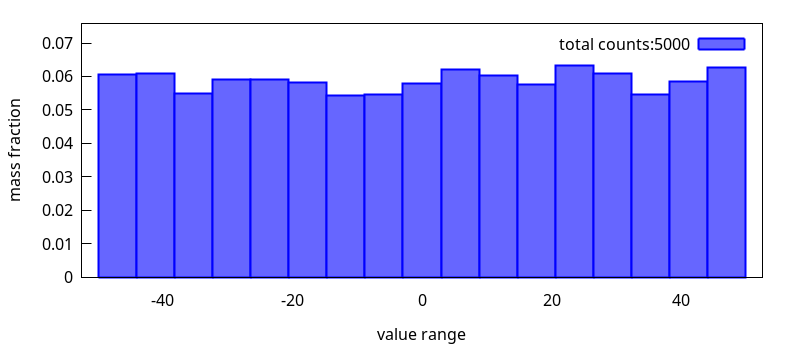
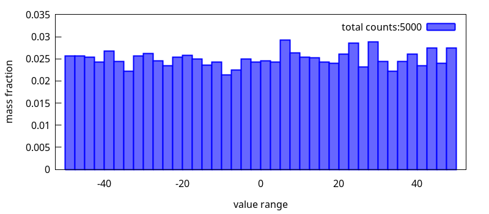
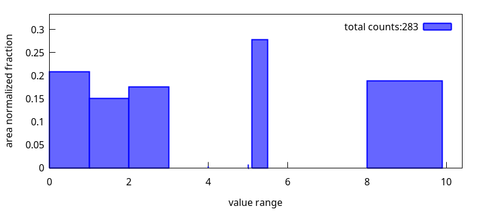
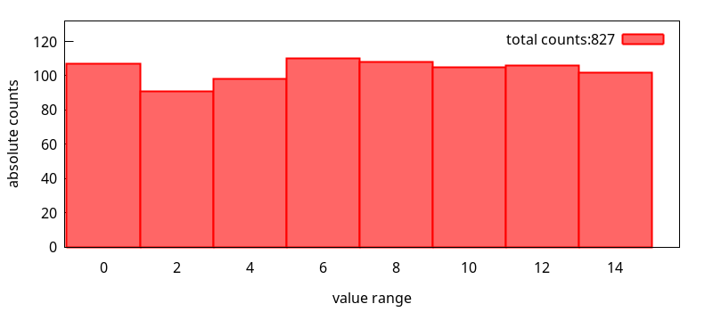
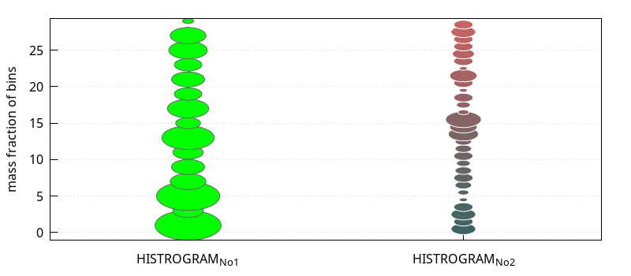
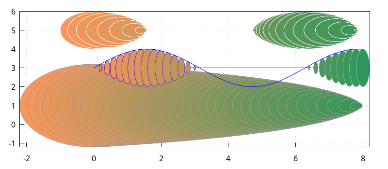

# Histogram_ext

# Introduction to histogram extended

Package *histogram_ext* contains user contributed code based on the *draw* package and the *descriptive* package. Both packages are loaded automatically when loading histogram_ext.mac and two histogram structures (histogram_structure, ) will be defined, please see chapter XXX and YYY. 

The main goal is to provide more options to express statistical data, especially in form of bubble graphs. Therefor it overs a couple of functions to gain histogram distributions from data in list as well as matrix form. This distributions are covered in a structure that can be later accessed in an easy and clean way.

The graphical part offers a basic bubble function as a generic function for *draw2d* and an easier function for presenting histogram data in a bubble plot. All function have several options to influence the appearance of the bubbles as well as there position in the graph.


## Histogram Extensions

By Marcus Menzel (2020)

​		Function for making histogram structures from data line or rows in matrices for further use.

### histogram_ext ( LIST , Options )											[Function]

Makes a histogram structure of type “*histogram_structure*”. See below for a detailed description of the content of the structure.

* histogram_ext ( LIST)	
* histogram_ext ( LIST , integer )
* histogram_ext ( LIST, bin-list )

Returns the histogram of LIST. LIST can be a flat list of integers, floats or rationals and matrices of rank 1 are accepted. The length of LIST must be >2 obvious otherwise an error is trigged. 

Providing a LIST only sets the number of symmetric bin according to an algorithm described by  Freedman and Diaconis  "n the histogram as a density estimator: L_2 theory. " in Zeitschrift für Wahrscheinlichkeitstheorie und verwandte Gebiete.  Band 57, Nr. 4, 1981, S. 453.

Providing a LIST and an integer sets this number as symmetric bins in between the lowest and highest values from LIST.

In case the parameter is a nested list given all numbers in the form [ [low_1, high_1],[low_2,high_2],... ] it will count the bins accordingly. A zero distance is fine, but the list needs to be sorted in ascending order 
to make sure no unwanted counting happens. If the classes don't match all list members, the total value in the resulting structure will differ from LIST.

The output is a structure of type “*histogram_structure*” with the internal lists (bounds, distance, count, mass_fraction, area_fraction, service), the last gives the minimal, maximal and total sum of values from the LIST and further information about LIST.

**Example:**

```lisp
load(“histogram_ext”) $

list_test : map( lambda ( [x], (x-50) ),
				 makelist( random(10000)/100, i, 1, 5000 )
			)										$
remvalue( example )									$
example   : new( histogram_structure )				$
example   : histogram_ext( list_test )				;
histogram_draw ( example, 'mass )					$
example   : histogram_ext( list_test, 40 )			$
histogram_draw ( example, 'mass )					$

list_bins : [ [0,1],[1,2],[2,3],[4,4],[5,5],
			  [51/10,55/10],[8.0,9.9]
			]										$
remvalue( example )									$
example   : new( histogram_structure )				$
example   : histogram_ext( list_test, list_bins )	$
histogram_draw ( example, 'area )					$

remvalue( example )									$
example   : new( histogram_structure )				$
example   : histogram_ext( list_test, 
                     makelist([i-1,i+1],i,0,14,2) 
			)										$
histogram_draw ( example, fill_color = red )		$
```










```lisp
load("histogram_ext.mac")$

STRUCT : histogram_ext(
    makelist( random(30), 200 ) ,
    makelist( [i,i+DELTA], i, 0, 30, DELTA )  )   ,DELTA=2 $

wxdraw2d(
    histogram_bubbles( STRUCT , 'mass,
		bubble_tilt=17, bubble_fill=green )	,
    histogram_bubbles( STRUCT2, 'mass, 
        bubble_x=2, bubble_tilt=17, bubble_fill=FANCY , bubble_line=white ) ,
    xtics  = { ["HISTROGRAM_{No1}", 1], ["HISTROGRAM_{No2}", 2] },
    xrange = [ 0.5, 2.5 ],
    grid   = true
)   ,   
STRUCT2 = histogram_ext( makelist( random(30), 200 ) ,     
                          makelist( [i,i+1], i, 0, 30, 1 )  )  ,   
FANCY   = makelist( 
                   printf(false,"#~2,'0x~2,'0x~2,'0x~2,'0x",i*5+60,100,100,0), 
                   i, 0, 30, 1 ) $
```



Categories: TBD (description ?? / draw ??)


## Draw extensions

### histogram_draw ( STRUCT , Options )								[Function]

Draws the result from STRUCT according to the given options in a *draw2d* graph and is affected by all options from the *bars* function.

* histogram_draw ( STRUCT )
* histogram_draw ( STRUCT, type )
* histogram_draw ( STRUCT, type, bars_options )

The accepted STRUCT is of type “histogram_structure” as delivered by histogram_ext function. 

The possible “type”s are 'area, 'mass, 'count and access the normalized area , the mass fraction and the as counted values from the *histogram_structure*, respectively.

See *histogram_ext* for a complete description and for a complete list of options see also function *bars* from package draw2d. In WxMaxima you are able to use wxhistogram_draw().

Categories: [Package draw](http://maxima.sourceforge.net/docs/manual/maxima_singlepage.html#Category_003a-Package-draw)


### histogram_bubbles ( STRUCT, Options ) [Graphics object f. Draw2d]

Draws a bubble series in 2D

* histogram_draw ( STRUCT )
* histogram_draw ( STRUCT, type )
* histogram_draw ( STRUCT, type, bubble_options )

The accepted STRUCT is of type “*histogram_structure*” as delivered by *“histogram_ext”* function.
The possible “type”s are 'area, 'mass, 'count and access the normalized area , the mass fraction
and the as counted values from the histogram_structure, respectively.

The purpose of this function is to make it easier for the user to use function bubble with histogram data.

See *histogram_ext* for a complete description and for a complete list of options see also function *bubbles* from package draw2d. In WxMaxima you are able to use wxhistogram_bubbles().

Categories: [Package draw](http://maxima.sourceforge.net/docs/manual/maxima_singlepage.html#Category_003a-Package-draw)


###bubbles ( LIST )										[Graphics object for Draw2d]

Draws a bubble series in 2D.

* bubbles ( LIST )
* bubbles ( LIST, Options )
* bubbles ( MATRIX )
* bubbles ( MATRIX, Options )

The LIST has to be a nested list containing the x, y coordinates then the radius value and the fill_color 
[ [x_1, x_2, .., x_n], [y_1, y_2, …, y_n], [r_1, r_2, …, r_n], [fill_color_1, fill_color_2, …, fill_color_n] ] or a LIST with an additional nested list for line_color. The length of all nested lists needs to be the same. 

```commonlisp
load("histogram_ext.mac")$

/* 
    All lists need to be of same length.
    Be aware that there are no negative radii - see example.
    Bubbles takes nested lists or rectangular tansposed matricies only.
 */
FROM    :   0   $
TO      :   8   $
DISTANCE:   1/5 $
atPOINT :   makelist( i, i, FROM , TO, DISTANCE )   $
list_x  :   makelist( i,        i, atPOINT )        $
list_y  :   makelist( 1,        i, atPOINT )        $
list_r  :   makelist( sin(i),   i, atPOINT )        $
list_RGB:   makelist( 
              printf(false, "#~2,'0x~2,'0x~2,'0x~2,'0x", 250-i*25, 150, 90, 0), 
              i, atPOINT 				   ) 		$
list_LL :   makelist( 
              printf(false, "#~2,'0x~2,'0x~2,'0x~2,'0x", 110, i*25, 190, 0)   , 
              i, atPOINT 				   ) 		$
CONTXT  :   transpose(
              apply(matrix,
                [ list_x, list_y+2, list_r, list_RGB, list_LL ]
                   )					   )		$
CONTXT  :   [ list_x, list_y+2, list_r, list_RGB, list_LL ]	$

wxdraw2d(
    points_joined   =   true		,
    point_size      =   0       	,
    points([[0,3],[8,3]])    		,
    bubbles( [list_x, list_y, log(reverse(atPOINT)+1), list_RGB] )	,
	/* next example shows how to adapt the bubble size to the real function */
    bubbles( CONTXT, bubble_scale_x = 0.2  ),
    color           =   blue		,
    points( atPOINT, sin(atPOINT)+3),
 	bubbles( [ list_x, 4+list_y , cos(atPOINT), list_RGB ], 
			 bubble_line=white )	,   
    grid=true
)													$
```

In case of providing a MATRIX be aware of the transposed orientation, otherwise LIST and MATRIX behave the same (see CONTXT in the example).



The following options are recognized:

- bubble_line = line_color for all bubbles (preset = gray60) 
  See HTML color code or color names in function *color* for package *DRAW*. Here is only one color value possible, for separate color use the extended LIST.
- bubble_tilt = real positive number (preset = 1) changes the elongation in y direction higher values stretches the bubbles lower values than 1 compress. Be aware that using this option changes the drawn values - it is an eye-candy option.
- bubble_scale_x = real positive number (preset = 1) changes the elongation in x direction higher values stretches the bubbles lower values than 1 compress. Useful if many bubble colums are drawn in one graph. Be aware that using this option changes the drawn values - it is an eye-candy option.
- further options are called before the graphic objects. There effect might be limited, except of global options for the draw2d objects.

Categories: [Package draw](http://maxima.sourceforge.net/docs/manual/maxima_singlepage.html#Category_003a-Package-draw)

